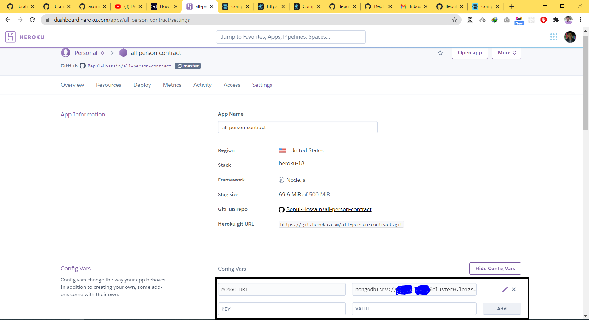

## Deploying MERN Stack to Heroku.

Assuming you have the following folder structure

```
├── client
│   ├── build
│   ├── public
│   ├── src
│   ├── .gitignore
│   ├── package.json
│   ├── README.md
│   └──src
├── models
│   ├── user.js
│   ├── books.js
│   └── index.js
├── public
├── routes
├── .gitignore
├── server.js
├── package.json
└── README.MD
```
> Note: all these steps below are done inside the main `server.js` file. In our case, inside server.js. 

#### Step 1


#### Step 2


#### Step 3


#### Step 4
> `package.json`

Heroku has 2 builds scripts that you can run either before or after the build. 

- heroku-prebuild

- heroku-postbuild

We're going to use the `heroku-postbuild` one. This is a change that we need to do inside the package.json, under the scripts section.

It should look like this


#### Step 5


## Quick start for locally run
```
=> git clone https://github.com/prevision-soft/working-chart.git
(Go to 'working-chart' folder then)
=> npm i
(Don't forgot to change MONGO_URI. You may follow the step 2)
=> npm run server
```

```
=> cd client
=> npm i
=> npm start
```